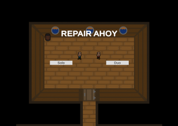

# Repair Ahoy (Global Game Jam 2020)

<iframe width="560" height="315" src="https://www.youtube.com/embed/xFi6Ic_uCyU" frameborder="0" allow="accelerometer; autoplay; clipboard-write; encrypted-media; gyroscope; picture-in-picture" allowfullscreen></iframe>

- [Link to GitHub repository](https://github.com/Half-Bent/GGJ2020)
- [Link to the game](https://globalgamejam.org/2020/games/repair-ahoy-9)

**Repair Ahoy** is a singleplayer/local-coop game, where you have to repair broken stuff to advance to the next room. Complete all rooms before timer runs out to win.

The game was our ([Half Bent](https://github.com/Half-Bent)) outcome in the **Global Game Jam 2020**. And it was also my first game jam. I helped [Anton Rautanen](https://github.com/sammuttaja) with the code and did graphics for the game.

> You're on a ship, trying to keep it afloat by fixing each room before the ship, you and the captain sinks. Player 1 uses WASD to move and Space to repair. Player 2 uses game controller's left joystick to move and X/A to repair.

