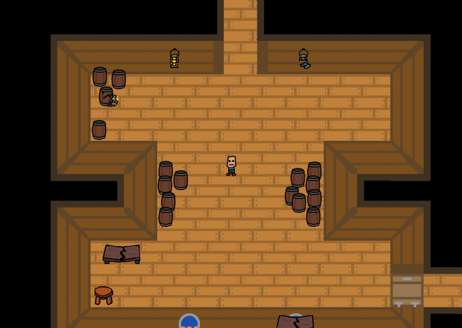
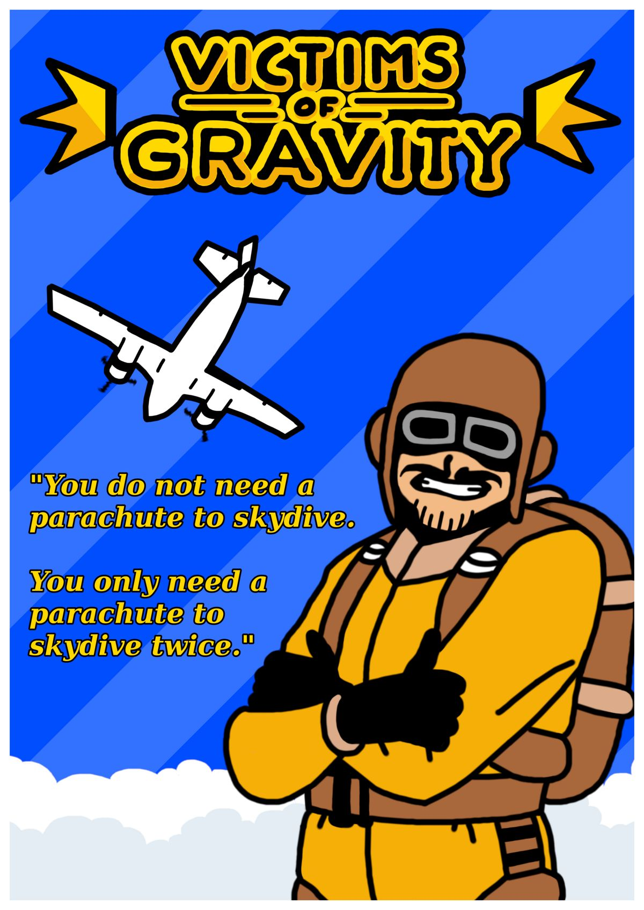

Unity enthusiast since 2018. ICT student in University of Turku. Basically a guy, who loves to develop things using Unity engine. Here be some projects that I have made with other awesome people!

---

## [Nth Year Student](./nth-year-student.html)

Resource management game

---

## [Repair Ahoy (Global Game Jam 2020)](./global-game-jam-2020.html)

Repair your ship before it sinks

---

## [Victims of Gravity](./victims-of-gravity.html)

Local-coop party game with skydiving

