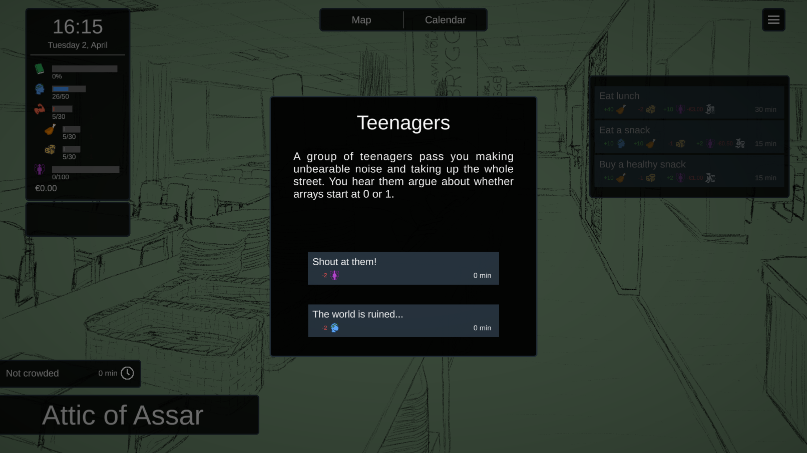

# Nth Year Student

<iframe width="560" height="315" src="https://www.youtube.com/embed/x6azoSQbE34" frameborder="0" allow="accelerometer; autoplay; clipboard-write; encrypted-media; gyroscope; picture-in-picture" allowfullscreen></iframe>

**Nth Year Student** is a resource management game where you play as a student from the university. You need plan your daily activities to balance your resources and study for the upcoming tasks and exams. There can also happen random events, depending on your location and actions. Currently still in development, possible new video, repository and download link coming soon.

This is a game project for courses "_Introduction to Game Development Tools_" and "_Project Course on Game Development_" at the University of Turku.

I've been programming, developing the UI, designing it with another team member and also fetched some free sound effects for the game.

