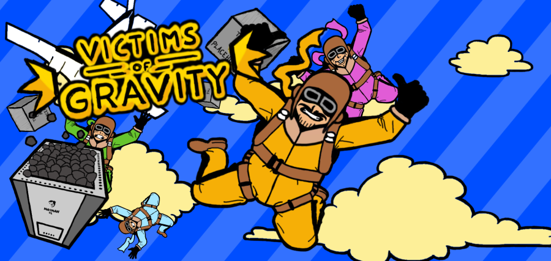

<iframe width="560" height="315" src="https://www.youtube.com/embed/Ulxa5mWuH8M" frameborder="0" allow="accelerometer; autoplay; clipboard-write; encrypted-media; gyroscope; picture-in-picture" allowfullscreen></iframe>

- [Link to GitHub repository](https://github.com/Half-Bent/Victims-of-Gravity-code)
- [Link to the game](https://www.assembly.org/summer18/demoscene/game-dev)

**Victims of Gravity** is a local-multiplayer party game, where you skydive with your friends and fight for the parachute to not become a victim of gravity.

This was originally developed for **Assembly Summer 2018** effectively in single month (not including some preliminary design process and brainstorming). This won 3rd place in Hatch Party competition and 8th place in Assembly game development competition.

We ([Half Bent](https://github.com/Half-Bent)) were a team of two; I programmed alongside with [Anton Rautanen](https://github.com/sammuttaja) and also created game's graphics.

> Jump right in to the chaos of skydiving. Your mission is not to become a victim of gravity. That is difficult because you forgot your working parachute at home. No worries though, the kind plane pilot dropped on for you all. If only you could hold on to it at the end.
>
> And not to make things too easy, there is a ton of obstacles to avoid while enjoying the views.

